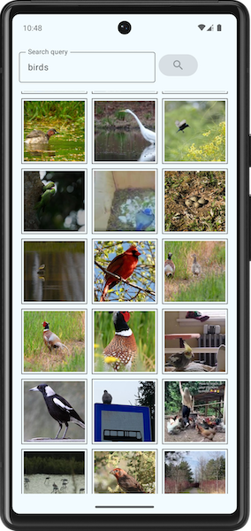

# ImageWire

A sample app that uses the Imgur API, allowing the user to enter a search query, scroll through thumbnails of the results, and click on an individual result to see it full-screen.

### Features:

- MVVM app architecture
- Hilt for dependency injection
- Paging Library for fetching paged data
- Jetpack Compose navigation
- Handling of loading and error states
- Unit tests

### Future TODO list:
- Album page: allow the user to view all images in an album rather than just the “cover”
- Top navigation bar showing title and back button
- Pinch & zoom support on the full-screen image view
- Pull-down refresh behavior (ie, if there was an error)